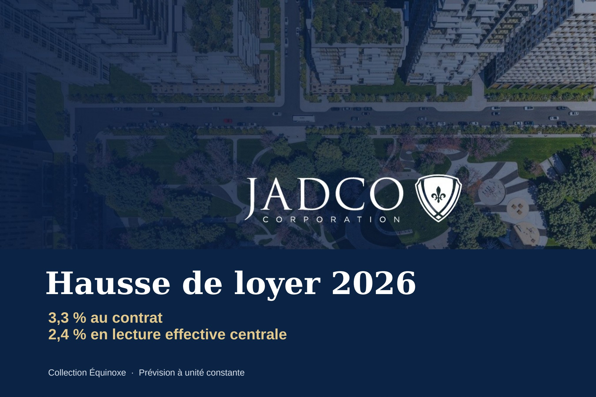
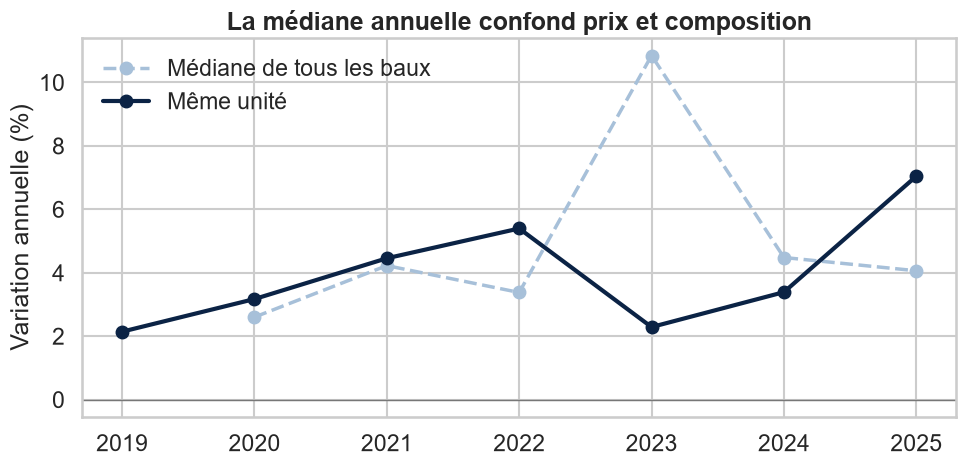
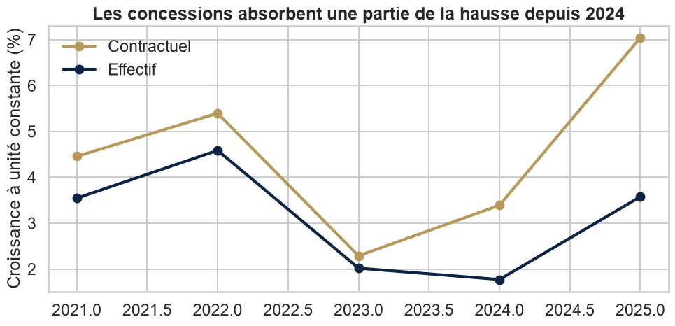
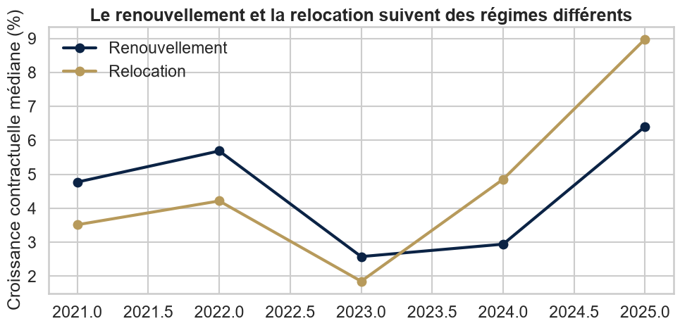
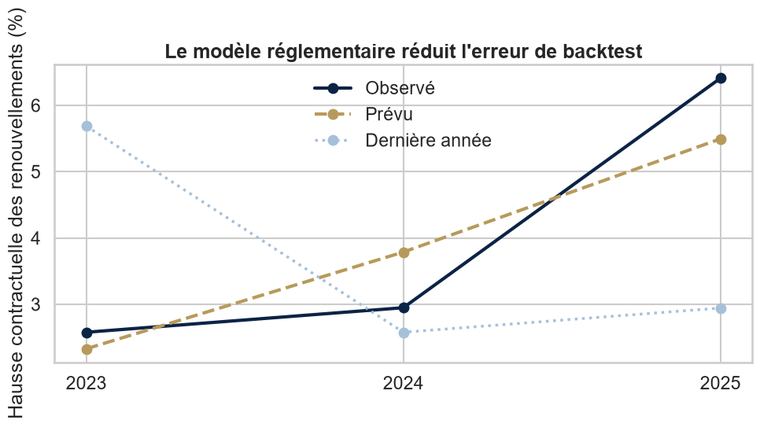
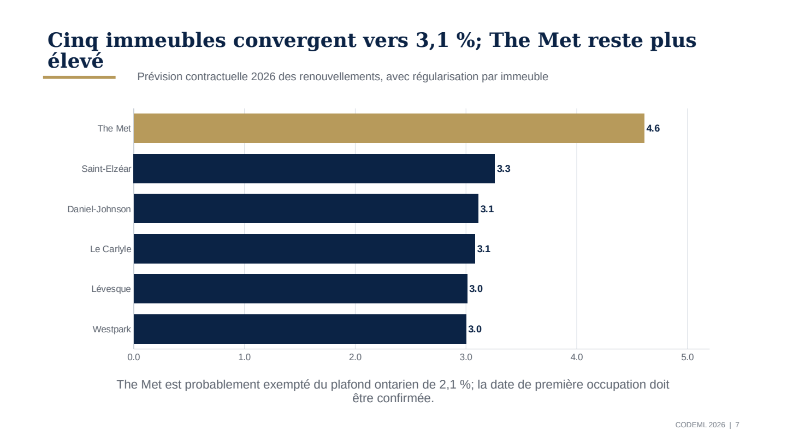

# Hausse de loyer 2026 · Collection Équinoxe

Projet réalisé pendant **CodeML 2026**, défi **JADCO « Clés en main »**.

La question : de combien les loyers de Collection Équinoxe vont-ils monter en 2026 ? Collection Équinoxe, c'est six immeubles locatifs à Laval, Mont-Royal, Pointe-Claire et Ottawa.



## Notre réponse en bref

| | Résultat |
|---|---|
| **Hausse contractuelle 2026** (renouvellements, même unité) | **3,3 %** |
| Plage de planification | 2,3 % à 4,3 % |
| Hausse du loyer réellement encaissé (après concessions, scénario central) | environ 2,4 % |
| Erreur moyenne du backtest 2023, 2024, 2025 | **0,67 point** |
| Erreur si on recopie simplement l'année d'avant | 2,32 points |

**Notre définition.** On mesure la hausse du loyer inscrit au bail (`sRent`) quand un locataire renouvelle dans le même appartement. Chaque appartement est comparé à son propre bail précédent, avec la clé `sPropCode + sUnitCode`. On prend la médiane par province, puis on fait une moyenne pondérée par le nombre de baux qui arrivent à échéance en 2026.

Pourquoi ce choix ? C'est la décision que JADCO contrôle vraiment : le prix du prochain bail. Les concessions (mois gratuits, stationnement offert) répondent à une autre question, celle de l'argent réellement encaissé. On garde donc les deux chiffres séparés.

## Ce qu'on a découvert

### 1. La médiane annuelle ment

En 2023, la médiane de tous les baux monte de 10,8 %. Mais quand on compare chaque appartement à lui-même, la vraie hausse est de 2,3 %. La différence vient de l'arrivée de trois immeubles plus chers (Le Carlyle et The Met en 2023, Westpark en 2024).



### 2. Les concessions mangent une partie de la hausse

En 2025, 85 % des baux ont une concession. Le loyer au contrat monte d'environ 7 %, mais le loyer encaissé seulement de 3,6 %. On a aussi vérifié que `PromoPay` n'est pas un montant mensuel : c'est en général une remise unique d'environ un mois de loyer.



### 3. Renouvellement et relocation, ce n'est pas pareil

Un locataire qui reste suit les règles du TAL (Québec) ou de l'Ontario. Un nouveau locataire suit plutôt le prix du marché. On sépare les deux avant de prévoir quoi que ce soit.



## La méthode

1. **Québec (5 immeubles).** Le paramètre TAL 2026 de 3,1 % sert de point d'ancrage.
2. **Ontario (The Met).** L'immeuble semble mis en service après novembre 2018, donc probablement exempté du plafond ontarien de 2,1 %. Son ancrage combine son propre historique et la prévision de la SCHL pour Ottawa. Le résultat est de 4,6 %.
3. **Pondération.** Les baux déjà connus qui finissent en 2026 donnent le poids de chaque province (environ 87 % Québec, 13 % Ontario).
4. **Concessions.** Trois scénarios : la situation se stabilise (0 %), elle continue un peu (25 %, scénario central) ou elle continue fort (50 %).
5. **Backtest.** On refait la prévision pour 2023, 2024 et 2025 en utilisant seulement l'information disponible avant chaque année.



**Bonus.** Prévision par immeuble et par nombre de chambres, avec un petit ajustement par segment (ramené vers la province selon la taille de l'échantillon et plafonné à 1 point).



## Pourquoi pas XGBoost ?

On a seulement neuf années de données et les règles ont changé en cours de route. Un modèle complexe apprendrait surtout le calendrier et l'arrivée des nouveaux immeubles. On a préféré une méthode simple, liée aux règles, qu'on peut expliquer et vérifier. Le backtest montre qu'elle fait mieux que de prolonger la tendance.

## Contenu du dépôt

```
.
├── solution_jadco_2026.ipynb      Notebook principal, déjà exécuté
├── presentation/
│   ├── presentation_jury_jadco_2026.pptx
│   └── presentation_jury_jadco_2026.pdf
├── docs/
│   └── pitch_jury.md              Trame de 5 minutes et réponses aux questions
├── figures/                       Graphiques utilisés dans ce README
├── jadco-participants/            Vide : mettre les CSV ici (non publiés)
├── requirements.txt
└── .gitignore
```

## Exécuter le notebook

Les données CRM de JADCO **ne sont pas dans ce dépôt**, comme demandé par les consignes. Il faut les fichiers reçus pendant le hackathon.

```bash
git clone <url-du-depot>
cd jadco-codeml-2026
python -m pip install -r requirements.txt
# copier les 4 CSV dans jadco-participants/
jupyter notebook solution_jadco_2026.ipynb
```

Le notebook cherche les CSV dans cet ordre : la variable `JADCO_DATA_DIR`, le dossier courant, `jadco-participants/`, puis `../jadco-participants/`.

Sous Windows (PowerShell), on peut aussi pointer vers un autre dossier :

```powershell
$env:JADCO_DATA_DIR = "C:\chemin\vers\jadco-participants"
```

**Versions testées :** Python 3.12, pandas 3.0, NumPy 2.3, matplotlib 3.11, seaborn 0.13.

## Limites

- Les poids viennent des renouvellements attendus dans l'extrait, pas du revenu total du portefeuille.
- Le 3,1 % du TAL est un paramètre de calcul. La hausse réelle d'un logement dépend aussi de ses dépenses, taxes et travaux.
- L'exemption de The Met est déduite de son arrivée en 2023. JADCO doit confirmer la date de première occupation. Sans exemption, son ancrage passe à 2,1 % et la cible du portefeuille baisse un peu.
- Les prévisions de la SCHL portent sur les deux chambres de toute la région, alors que le portefeuille a plusieurs tailles et des immeubles haut de gamme.
- L'extrait ne permet pas de calculer l'occupation, l'inoccupation ni le rôle de loyers total.

## Sources publiques

- TAL, pourcentages 2026 : https://www.tal.gouv.qc.ca/fr/reconduction-du-bail-et-fixation-de-loyer/pourcentages-applicables-aux-criteres-de-fixation-de-loyer
- Ontario, ligne directrice et exemptions : https://www.ontario.ca/page/residential-rent-increases
- SCHL, Rapport sur le marché locatif 2025 : https://www.cmhc-schl.gc.ca/professionnels/marche-du-logement-donnees-et-recherche/marches-de-lhabitation/rapports-sur-le-marche-locatif
- SCHL, Perspectives du marché de l'habitation, mise à jour été 2025 : https://www.cmhc-schl.gc.ca/observer/2025/summer-update-2025-housing-market-outlook
- Statistique Canada, IPC des loyers : https://www150.statcan.gc.ca/n1/daily-quotidien/251021/cg-a005-fra.htm

## Outils d'IA

- **OpenAI Codex** a aidé à structurer le code, vérifier les calculs, rédiger la documentation et préparer les livrables.
- **Claude** (Anthropic) a aidé à organiser ce dépôt GitHub et à rédiger ce README.

Tous les calculs sont visibles dans le notebook et peuvent être refaits avec les données.

## Données

Les données de Collection Équinoxe appartiennent à JADCO. Elles ne sont ni publiées ni incluses ici. Seuls des résultats agrégés (médianes, comptes, graphiques) apparaissent dans le notebook et ce README.
